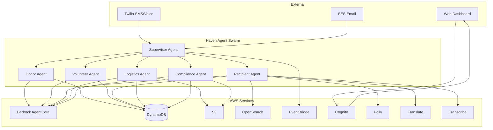

<div align="center">

# Haven

### The agent behind every helping hand.

**Autonomous operations for food banks, shelters, and mutual aid networks.**

[](https://github.com/haven-agent/haven/actions/workflows/ci.yml)
[](https://github.com/haven-agent/haven/actions/workflows/security.yml)
[](https://codecov.io/gh/haven-agent/haven)
[](LICENSE)
[](https://www.python.org/downloads/)
[](https://github.com/strands-agents/sdk-python)

[Live Demo](https://haven-agent.org) · [Documentation](docs/ARCHITECTURE.md) · [Contributing](CONTRIBUTING.md) · [Discord](https://discord.gg/haven-agent)

</div>

---

## What is Haven?

Haven is a **multi-agent AI system** that runs the invisible logistics of community aid — matching donations to needs, volunteers to shifts, and recipients to resources — so the humans who show up can focus on the humans they serve.

A typical food bank director spends **60% of their week** on tasks that aren't feeding people: reading donation texts, manually matching volunteers, answering the same questions, filling compliance reports. Haven automates all of it with a swarm of five specialized AI agents.

> *"247,000 meals coordinated. 1,847 volunteers managed. 12-second average response time. This isn't a chatbot — it's an operations layer."*


## Features

| Feature | Description |
|---------|-------------|
| **Donor Agent** | Parses donation offers via SMS, email, or voice. Assesses cold-chain needs. Negotiates pickups. Generates tax receipts. |
| **Volunteer Agent** | Matches volunteers to shifts using skills, availability, and history. Handles no-shows. Sends SMS offers. |
| **Recipient Agent** | Multi-language voice/SMS assistant. Finds pantries, checks hours, verifies eligibility. 8 languages. |
| **Logistics Agent** | Routes food from donors to distribution points. Respects cold chain. Generates driver manifests. |
| **Compliance Agent** | Auto-generates USDA reports, tax receipts, food safety logs. Immutable audit trails. |
| **Agent Supervisor** | Orchestrates the swarm. Routes events. Escalates to humans when needed. |
| **Real-time Dashboard** | Watch agents reason in real time. Kanban for donations. Volunteer roster. Multi-language inquiry feed. |

## Architecture



## Quick Start

### Prerequisites

- Python 3.12+
- Node.js 20+
- pnpm 9+
- uv (Python package manager)
- AWS CLI configured

### 1. Clone & Install

```bash
git clone https://github.com/haven-agent/haven.git
cd haven
pnpm install

# Python backend
cd services/agents
uv sync
```

### 2. Configure

```bash
cp .env.example .env
# Edit .env with your AWS credentials and Twilio config
```

### 3. Run

```bash
# Backend (port 8000)
cd services/agents
uv run python -m haven.main

# Frontend (port 3000)
cd apps/web
pnpm dev
```

Open [http://localhost:3000](http://localhost:3000) to see the dashboard.

## Stack

| Layer | Technology |
|-------|-----------|
| **Frontend** | Next.js 14, TypeScript, Tailwind CSS, shadcn/ui, Framer Motion |
| **Backend** | Python 3.12, Strands Agents SDK, FastAPI, Pydantic v2 |
| **AI Models** | Claude Sonnet 4.5 (reasoning), Nova Micro (routing) |
| **AWS** | Bedrock AgentCore, DynamoDB, S3, OpenSearch, Cognito, Polly, Transcribe, Translate |
| **Comms** | Twilio (SMS/voice), SES (email), EventBridge |
| **Observability** | Langfuse, CloudWatch, X-Ray |
| **Infrastructure** | AWS CDK, GitHub Actions |

## Repository Structure

```
haven/
├── apps/web/              # Next.js dashboard
├── services/
│   ├── agents/            # Strands multi-agent swarm
│   │   ├── haven/
│   │   │   ├── agents/    # 5 agents + supervisor
│   │   │   ├── tools/     # 20+ agent tools
│   │   │   ├── api.py     # FastAPI layer
│   │   │   ├── config.py  # Pydantic settings
│   │   │   └── models.py  # Domain models
│   │   └── pyproject.toml
│   └── infra/             # CDK infrastructure
├── packages/              # Shared packages
├── docs/
│   ├── ARCHITECTURE.md
│   ├── AGENTS.md
│   ├── DEMO.md
│   └── BLOG_POST.md
├── .github/workflows/     # CI/CD
├── LICENSE                # Apache 2.0
├── SECURITY.md
├── CONTRIBUTING.md
└── CODE_OF_CONDUCT.md
```

## Contributing

We welcome contributions! See [CONTRIBUTING.md](CONTRIBUTING.md) for guidelines.

```bash
# Development setup
pnpm install
cd services/agents && uv sync

# Run tests
pnpm test
cd services/agents && uv run pytest

# Lint
pnpm lint
cd services/agents && uv run ruff check .
```

## Security

Haven takes security seriously. See [SECURITY.md](SECURITY.md) for our security policy, threat model, and responsible disclosure process.

## License

Licensed under the [Apache License, Version 2.0](LICENSE).

## Acknowledgments

Built for the [AWS Agents for Humans Hackathon](https://devpost.com/software/haven) using the [Strands Agents SDK](https://github.com/strands-agents/sdk-python).

Dedicated to every food bank director, shelter coordinator, and mutual aid organizer doing the invisible work of keeping communities fed.

---

<div align="center">

**[Live Demo](https://haven-agent.org)** · **[GitHub](https://github.com/haven-agent/haven)** · **[Discord](https://discord.gg/haven-agent)**

*The agent behind every helping hand.*

</div>
